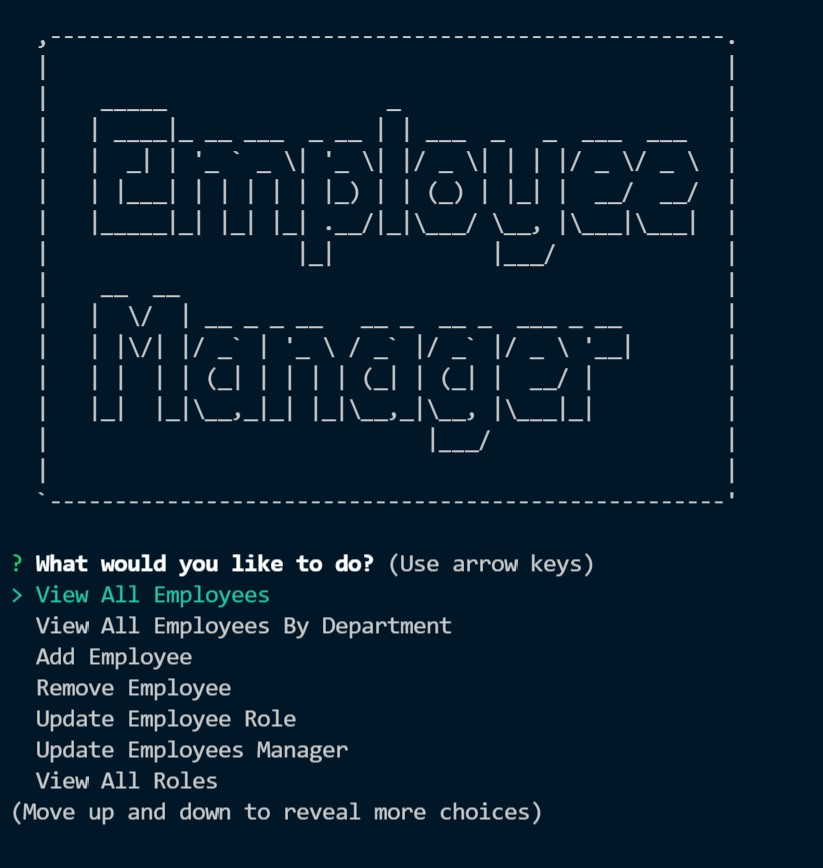

# Employee Tracker - Homework 12

## Description

This command-line content management system allows non-developers to easily view and interact with an employee database. View and manage employees, roles, managers, and entire departments quickly and easily--no programming tomorrow.

## Installation

- To see the code repository, visit my [Github](https://github.com/patrickbrown-io/sql-employee-tracker)

- To install this app, clone the repository and npm i.

## Usage

Schema and seed files included in the db/
To run, navigate to the root and enter 'node server.js' or use the script 'npm run start'.

You will be presented with options to View All Departments, View All Roles, View All Employees, Add a Department, Add a Role, Add an Employee, Update an Employee Role, Update an Employee's Manager, View Employees by Manager, View Employees by Department, Delete departments, roles, and employees.

## Walkthrough

Video walkthrough of working application: [YouTube](https://www.youtube.com/watch?v=0YLjHhShCP8)

## Credits

[Patrick Brown](https://github.com/patrickbrown-io)

## Features

- Easy to use command line CMS
- Create, Delete, and View all departments with nicely formatted tables via mySQL2.
- Create, Delete, and View all roles, with job title, role id, department, and salary
- Create, Delete, and View all Employees with a nicely formatted table. See their names, job titles, departments, salaries, and manager
- mySQL2, ASCII-art Logo, Node, Express, Inquirer, console.table

## How to Contribute

Send me a message via GitHub and we can connect!
